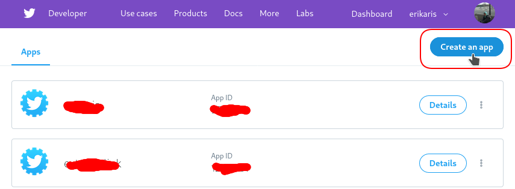
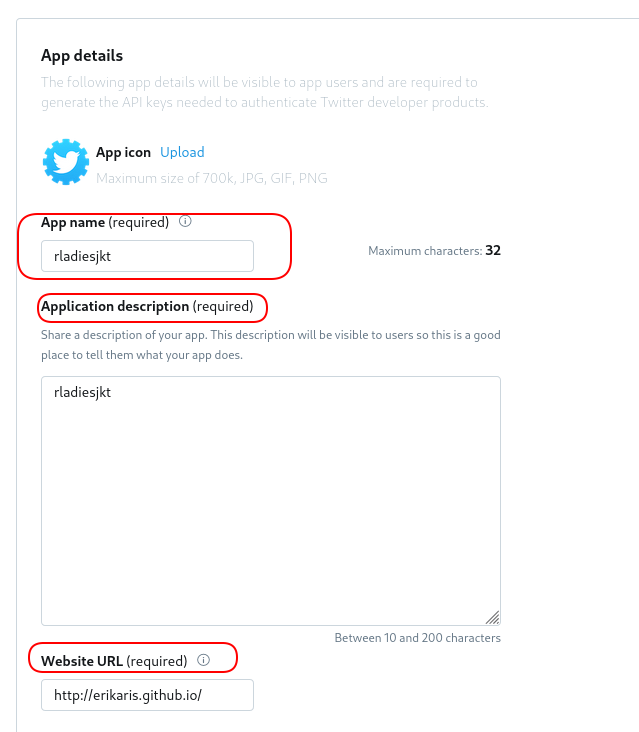
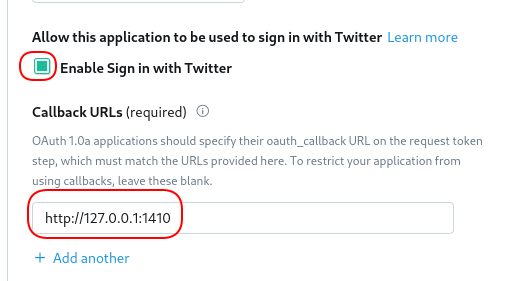
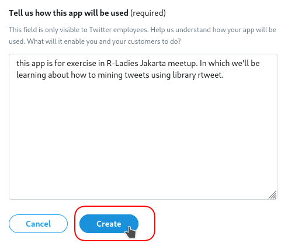
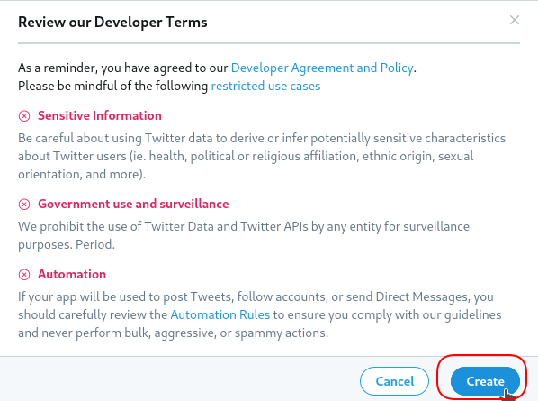
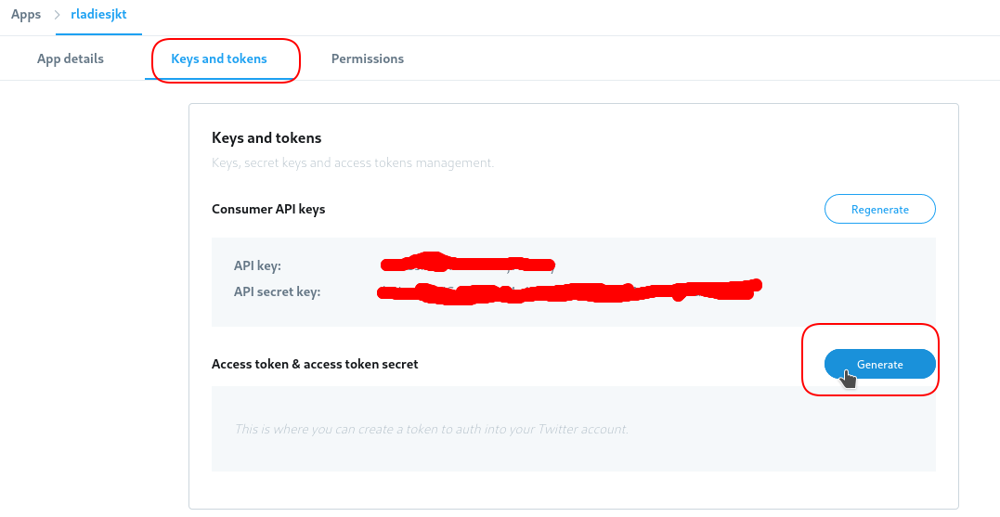
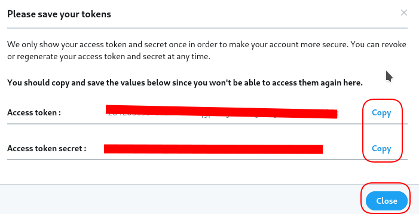

# Preparation for R-Ladies Jakarta 8th Meetup

It's strongly encouraged that you already have a Twitter Account in order to be able to follow the meetup material. If you do not have a Twitter account, please create one and follow @rladiesjakarta and @rladiesbogor :)

## I. Setting Up Your Twitter Account
### I.I Twitter API Authorization
1. Login to [developer.twitter.com](https://developer.twitter.com/en/apps) using your Twitter credentials (user name and password). 

2. Create new app to obtain keys and tokens. 


3. Fill up all the required fields and hit the 'create' button.  <br />
   

   



4. Review the developer teams and hit the 'create' button. <br />


### I.II Generate Key and Token 
1. Go to the tab 'Keys and tokens' and generate the access token and access token secret. <br />


2. Save the keys from step 1 and tokens from this step to notepad or other text editors. <br />


3. You're all set!


## II. Installing the Required Libraries
```
install.packages("rtweet")        # R client for accessing Twitter's REST and stream APIs
install.packages("wordcloud")     # for creating wordcloud
install.packages("tidyverse")
install.packages("igraph")        # for creating network graph
install.packages("tm")            # for text mining
install.packages("RColorBrewer")  # for coloring things
```


